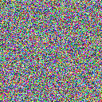

# UnifyID-Challenge
This is my solution to the UnifyID coding challenge

## Approach

#### Solution

I implemented an image generator that creates RGB bitmap files with random pixel values. The random numbers are retrieved from Random.org.

#### Problems

Random.org has a data quota for requests to their API. To stay within this limit I implemented a "low usage" mode that reduces the amount of requests made and at a certain point reduces the size of requests. To make up for the lack of true random numbers the existing random number dataset is psuedo-randomly shuffled using Python's built in shuffle. This produces a less random bmp file, however this "feature" was primarily written for my own needs while doing test runs to avoid being banned from Random.org.

#### Result

## How to Run

#### Dependencies

* [Requests](http://docs.python-requests.org/en/master/user/install/#install)

* [Pillow/PIL](https://pillow.readthedocs.io/en/latest/installation.html#basic-installation)

#### Running

Simply install the above dependencies, clone this repo to your machine and run

>python solution.py

from the command line within the directory of this project

